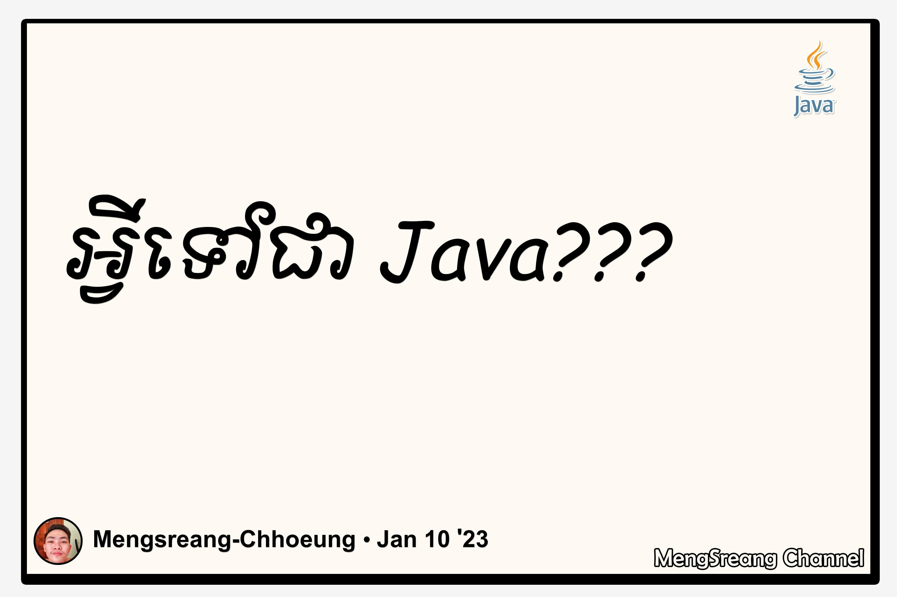

មុននឹងឈានដល់ការយល់ដឹងអំពីភាសា Java ថាជាអ្វី យើងអាចទៅមើលពីប្រវត្តិខ្លះៗរបស់ភាសា Java ដែលវាគឺជាភាសាមួយដែលត្រូវបានបង្កើតឡើងដោយលោក James Gosling។ គាត់ជាបុគ្គលិកធ្វើការនៅក្រុមហ៊ុន Sun Microsystems នៅក្នុងគម្រោងស្រាវជ្រាវមួយឈ្មោះថា Green Project នៅឆ្នាំ ១៩៩១។ គម្រោងនេះបានប្រើភាសាមួយដែលមូលដ្ឋានឈរលើភាសា C និង C++។ ដំបូងឡើយភាសានេះឈ្មោះថា Oak បន្ទាប់ពីលោកបានឃើញដើម Oak តាមរយៈបង្អួចការិយាល័យរបស់គាត់ក្នុងក្រុមហ៊ុន Sun។ តែឈ្មោះនេះត្រូវបានប្តូរតាមសំណើររបស់មិត្តរួមការងាររបស់គាត់ទៅជា Java បន្ទាប់ពីគាត់ចេញពីហាងកាហ្វេ ហើយក៏មានឈ្មោះថា Java រហូតមកដល់សព្វថ្ងៃនេះ។ ការងាររបស់ Green Project មានការលំបាកខ្លាំងជាហេតុធ្វើឲ្យកិច្ចព្រមព្រៀងសំខាន់មួយរបស់ក្រុមហ៊ុន Sun ត្រូវបានប្រគល់ឲ្យក្រុមហ៊ុនដទៃ។ ការងាររបស់ Green Project ស្ទើរតែដួលរលំទៅហើយ តែសំណាងល្អនៅឆ្នាំ ១៩៩៣ World Wide Web បានលេចធ្លោឡើងបានធ្វើឲ្យអ្នកធ្វើការនៅក្រុមហ៊ុន ​Sun មើលឃើញយ៉ាងច្បាស់ពីអនុភាពនៃកាប្រើ Java ដើម្បីបង្កើត Web Page វាបានធ្វើឲ្យគម្រោងនេះដើរសារជាថ្មីវិញ។

គេថា Java មានលក្ខណៈ Simple, Object Oriented, Statically Typed, Compiled and Interpreted, Architecture Neutral and Portable, Multithreaded, Garbage Collected, Robust, Secure, Built-in Networking និង Extensible។

- Simple : អ្នកបង្កើត Java បានលុបបំបាត់ចោលនូវលក្ខណៈមិនចាំបាច់មួយចំនួនរបស់ភាសាសំណេរកម្មវិធី ដូចជា Java មិនប្រើ Pointers, Structures, Unions, Template, Header file ឬ Multiple Inheritance ជាដើម។

- Object Oriented : ដូចនឹងភាសា C ឬ C++ ដែរ គឺប្រើ Classes ដើម្បីរៀបចំ Code ឲ្យទៅជាសំនុំមួយត្រឹមត្រូវ ហើយវាបង្កើត Objects តាមរយៈ Classes។ Class របស់ Java អាចទទួលលក្ខណៈពី Class មួយផ្សេងទៀត។ ប៉ុន្តែ Class មួយមិនអាចទទួលលក្ខណៈពី Classes ច្រើនបានឡើយ។

- Statically Typed : គ្រប់ Object ទាំងអស់មុនពេលប្រើប្រាស់នៅក្នុងកម្មវិធីមួយ ដាច់ខាតត្រូវតែប្រកាសវាជាមុនសិន។ លក្ខណៈនេះអាចធ្វើឲ្យ Compiler របស់ Java រកឃើញនូវទីតាំងនិងប្រាប់ឲ្យដឹងនូវប្រភេទទិន្នន័យដែលមិនត្រូវគ្នា។

- Compiled and Interpreted : មុននឹងយើងអាចដំណើរការកម្មវិធីមួយដែរសរសេរឡើងជាភាសា Java បាននោះលុះតា្រតែយើង Compile វាតាមរយៈ Compiler ជាមុនសិន។ នៅពេល Compile រួចដោយជោគជ័យ វានឹងបង្កើតបាន File មួយផ្សេងទៀតប្រភេទជា Byte-Code ដែលស្រដៀងគ្នាទៅនឹង Machine-Code ហើយវាអាចដំណើរការក្នុងប្រព័ន្ធ Computer ដោយមាន Interpreter របស់ Java។ Interpreter ជាអ្នកបកប្រែពី Byte-Code ទៅជាពាក្យបញ្ជាប្រភេទ Machine-Code។ ហេតុនេះហើយបានជាគេថា​ Java មានលក្ខណៈ Compiled and Interpreted។

- Architecture Neutral and Portable : ដោយសារកម្មវិធីដែលសរសេរឡើងដោយ Java ត្រូវបាន Compiled ជាទម្រង់ Byte-Code ដែលមានលក្ខណៈមិនអាស្រ័យនឹងទម្រង់ខាងក្នុងរបស់ Computer ជាហេតុធ្វើឲ្យកម្មវិធីដែលសរសេរឡើងដោយ Java អាចដំណើរការលើប្រព័ន្ធណាមួយក៏បាន(មិនប្រកាន់ platform)។

- Multithreaded : Java មាន threads សម្រាប់អនុវត្តធ្វើការប្រតិបត្តិការងារច្រើនក្នុងពេលតែមួយបាន។

- Garbage Collected : Java បានធ្វើការប្រមូលនូវអ្វីៗដែលមិនចាំបាច់ លុបចោលពី Memory ដោយខ្លួនឯង មិនចាំបាច់សរសេរ Code ដើម្បីលុប​ Object ដែលមិនប្រើនោះទេ(បានន័យថា Variables ឬ Objects ណាដែលឈប់ប្រើហើយវានឹងលុបចោលដោយខ្លួនឯង ជួយសម្រួលដល់អ្នកសរសេរកម្មវិធីមិនព្រួយបារម្មណ៍ពីការខ្វះខាត Memory ដោយសារ​ Objects មិនបានការនោះឡើយ)។

- Robust : ដោយសារ​ Interpreter របស់ Java ពិនិត្យគ្រប់ដំណើរការចូលទៅក្នុងប្រព័ន្ធទាំងអស់របស់កម្មវិធី ជាហេតុធ្វើឲ្យកម្មវិធីដែលសរសេរដោយ Java មិនប៉ះពាល់ដល់ប្រព័ន្ធ Computer ឡើយ។ កាលណាវាមាន Error វានឹងបង្កើតជា Exception។

- Secure : វាមិនគ្រាន់តែត្រួតពិនិត្យរាល់ដំណើរការចូលក្នុង Memory ប៉ុណ្ណោះទេ វាថែមទាំងធានា មិនឆ្លង Virus នៅពេលកំពុងដំណើរការកម្មវិធីទៀតផង ព្រោះវាមិនប្រើ Pointer ធ្វើឲ្យ Virus មិនអាចចូលទៅកាន់ Memory នៃប្រព័ន្ធ Computer បានឡើយ។

- Built-in Networking : Java បានបង្កើតឲ្យមានការប្រើលក្ខណៈជាបណ្តាញ ដោយនាំមកនូវ Classes ជាច្រើនសម្រាប់បង្កើតទំនាក់ទំនងជាមួយ Internet។

- Extensible : Java អាចឲ្យប្រើនូវ native methods ដែលជា Functions ដែលសរសេរឡើងក្នុងភាសាផ្សេងៗដូចជា C ឬ C++ ជាដើម។ លក្ខណៈនេះវាធ្វើឲ្យអ្នកសរសេរកម្មវិធី សរសេរ function ដែលអាចប្រតិបត្តិការបានលឿនជាងការសរសេរ functions នៅក្នុង Java។ Native Methods ដំណើរការភ្ជាប់ទៅនឹងកម្មវិធី Java មានន័យថាវាបញ្ជូលជាមួយកម្មវិធីនៅក្នុងពេលដំណើរការកម្មវិធី។ នៅពេលដែល Java ត្រូវបានជម្រុញលើបញ្ហាល្បឿននោះ Native Methods ប្រហែលជាអត់ត្រូវការទៀតឡើយ។ លើសពីនេះ Java អាចឲ្យគេប្រើជាមួយនឹងកម្មវិធីផ្សេងទៀតបានដូចជា Microsoft Access និង HTML ជាដើម។
