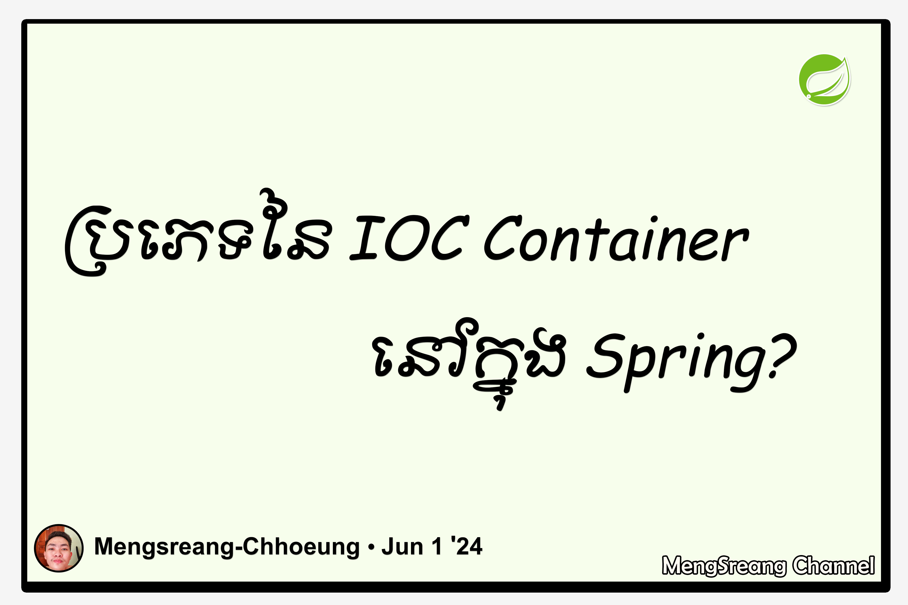

[ENGLISH BELOW]

**Spring Framework** បានផ្តល់នូវមុខងារមួយគឺ **IOC Container** ដែល **IOC** មានពាក្យពេញគឺ **Inversion of Control**។ បន្ថែមពីនេះ **IOC Container** ក៏បានបែងចែកជាពីរប្រភេទដែលរួមមានដូចខាងក្រោម៖

- BeanFactory - ជា container ធម្មតា។
- ApplicationContext - ជា container ដូចទៅនឹង BeanFactory ដែរតែបានបន្ថែមនូវមុខងារជាច្រើនទៀត ដែលមានដូចជា Spring AOP integrations, message resource handling (I18N), event propagation, application layer specific context។ល។

---

The **Spring Framework** provides a function called **IOC Container**, which **IOC** stands for **Inversion of Control**. In addition, **IOC Containers** are also divided into two categories, including the following:

- BeanFactory - A simple container.
- ApplicationContext - A container similar to BeanFactory, but with additional functions such as Spring AOP integrations, message resource handling (I18N), event propagation, application layer specific context, etc.
