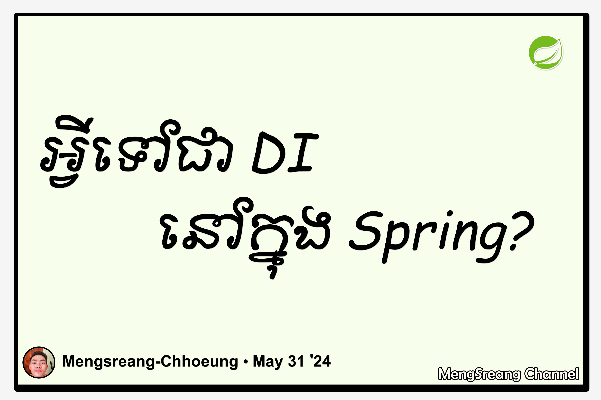

[ENGLISH BELOW]

**Spring Framework** បានផ្តល់នូវមុខងារមួយគឺ **DI** ដែល មានពាក្យពេញគឺ **Dependency Injection**។ វាជាមុខងារពិសេសមួយនៅក្នុង _core_ នៃ **Spring Framework** ហើយតួនាទីរបស់វាគឺជាអ្នកហៅនូវ _instances_ ឬក៏ _beans_ ដែលត្រូវបានបង្កើតឡើងដោយ [IOC Container](./what-do-you-mean-by-ioc.md) យកមកប្រើ ហើយប្រភេទនៃការហៅគឺមានចំនួនបី៖

- Constructor injection – ហៅប្រើដោយប្រើប្រាស់ Constructor
- Setter injection – ហៅប្រើដោយប្រើប្រាស់ Setter Methods
- Field injection – ហៅប្រើដោយប្រើប្រាស់ Fields

---

The **Spring Framework** provides a feature called **DI**, which stands for **Dependency Injection**. It is a special function in the _core_ of the **Spring Framework**, and its role is to inject _instances_ or _beans_ created by the [IOC Container](./what-do-you-mean-by-ioc.md), and there are three types of injection:

- Constructor injection – injection using constructor
- Setter injection – using setter methods
- Field injection – directly into the fields
